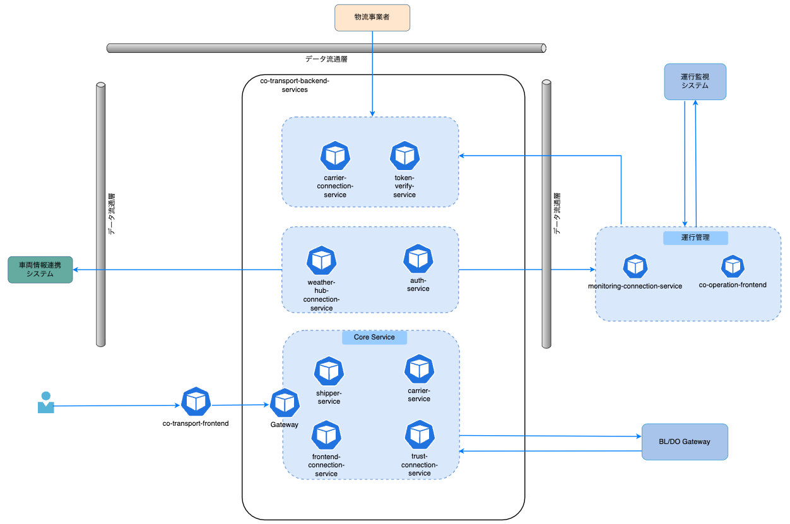

# Auth Service - 認証サービス

## 概要・目的
このサービスは、システム全体の認証・認可を管理する中央認証サービスです。ユーザー認証、システム認証、トークン管理などの機能を提供します。
以下、アーキテクチャ概要を示す。  


本システムは[auth-service](https://github.com/ODS-IS-CAVC/co-transport-backend-services/tree/main/auth-service)です。
## 前提環境
- Java 17 以上 24 以下
- Maven 3.9.7

## ビルド・起動手順
1. リポジトリをクローンします。
    ```bash
    git clone https://github.com/ODS-IS-CAVC/co-transport-backend-services.git
    ```
2. プロジェクトディレクトリに移動します。
    ```bash
    cd co-transport-backend-services/auth-service
    ```
3. [共通ライブラリー](https://github.com/ODS-IS-CAVC/co-transport-backend-common.git)のREADME.mdに記載されている手順に従って共通ライブリーをイントールします。

4. 依存関係をインストールし、ビルドします。
    ```bash
    mvn clean install
    ```

5. サーバーを起動します。
例：
    ```bash
      mvn spring-boot:run -Dspring-boot.run.profiles=dev
    ```

## テスト手順
- Postmanなどで `http://localhost:9600` にAPIをたたき、確認してください。

## 設計標準
### システム連携
  - RESTful APIの提供
  - 外部システムとの連携
  - データ同期処理

### セキュリティ
  - ユーザー認証・認可
  - データアクセス制御
  - 監査ログ管理

### アーキテクチャ設計
- レイヤードアーキテクチャの採用
  - Presentation Layer: API エンドポイント
  - Application Layer: ビジネスロジック
  - Domain Layer: ドメインモデル
  - Infrastructure Layer: データアクセス、外部サービス連携

### セキュリティ設定
- JWT認証
- パスワードポリシー: 最小8文字、英数字混在
- レート制限: IPアドレスごとに制限
- CORS設定: 許可されたオリジンのみ

## コーディング規約
- コーディングスタイルは`Google Java Style Guide`に従う
- 開発は`develop`ブランチで行い、安定版は`main`ブランチにマージ

## 処理概要
サービスは以下の主要な処理を提供します：
- ユーザー認証
  - 認証処理
  - トークン発行
  - セッション管理
  - 権限制御

- システム認証
  - システム間認証
  - APIキー管理
  - サービス連携

- トークン管理
  - トークン発行
  - トークン更新
  - トークン無効化
  - 有効期限管理

## 問合せ及び要望に関して
- 本リポジトリは現状は主に配布目的の運用となるため、IssueやPull Requestに関しては受け付けておりません。

## ライセンス
- このプロジェクトは [MITライセンス](../LICENSE.txt) のもとで公開されています。  
- 特筆が無い限り、ソースコードおよび関連ドキュメントの著作権はNEXT Logistics Japan株式会社に帰属します。

## 免責事項
- 本リポジトリの内容は予告なく変更・削除する可能性があります。
- 本リポジトリの利用により生じた損失及び損害等について、いかなる責任も負わないものとします。
